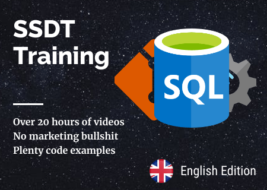
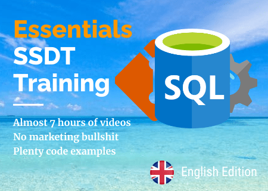

# SSDT Training

| [English Version](#) | [Polish Version](./pl/README.md) |

All code from full ssdt training.  

SSDT is a great tool if you're looking for a solution to manage and deploy your SQL Server database or Azure SQL databases. It's a free tool from Microsoft (provided within Visual Studio), but sometimes we don't know how to start and how to:  
* Import existing database(s) from a physical server
* Use DACPAC file and what's that?
* Understand the concept and use SQLPackage
* Build end-to-end CI/CD process

I've been working with SSDT for many years now. This repository contains a code for all demo of comprehensive online-course I prepared in 2020.  
Take a look if you're interested. The whole course is available here:  
**Polish edition:** [Projekty bazodanowe w SQL Server Data Tools SSDT](https://learn.sqlplayer.net/projekty-bazodanowe-w-sql-server-data-tools-ssdt)  
**English edition:** [Database projects with SQL Server Data Tools (SSDT)](https://learn.sqlplayer.net/database-projects-with-ssdt-dacpac)

The first edition (Polish language only) has been released in 2020.  
The first English edition was released on 3th of July 2021.  
The cost of the 20-hour course is $195.  

At the beginning of year 2022, compacted version of English edition course appeared.  
"Essentials of database projects with SSDT" costs **$99 only**.  

> The differences between these two editions are described in [this blog post](https://sqlplayer.net/2022/01/database-projects-with-sql-server-data-tools-ssdt/).

If you not ready to buy an entire course, [sign up for free materials](https://learn.sqlplayer.net/ssdt-tips) and tips for 8 weeks.

Enjoy!  
*Kamil*

# Course scope

## Module 1: Introduction & Installation
Duration: 83 min.
* A. Welcome and introduction (📽️ [Free lesson](https://learn.sqlplayer.net/courses/database-projects-with-ssdt-dacpac/658130-module-1/2127229-welcome-and-introduction))
* B. Installing SSDT
* C. Two approaches: State vs Migration
* D. Tools comparison
* E. Automation, DevOps, CI/CD
* F. Summary (📽️ [Free lesson](https://learn.sqlplayer.net/courses/database-projects-with-ssdt-dacpac/658130-module-1/2127258-summary))
* G. Quiz

## Module 2: Versioning fundamentals with GIT
Duration: 89 min.
* A. Git Mini-Course - Introduction
* B. Installation of utilities
* C. Project cloning
* D. Create a new project (📽️ [Free lesson](https://learn.sqlplayer.net/courses/database-projects-with-ssdt-dacpac/729810-module-2/2127847-create-a-new-project))
* E. Basic commands (PULL, COMMIT, PUSH)
* F. New developer branch
* G. Pull Request and MERGE to the master branch
* H. Summary
* I. Quiz

## Module 3: Working with SSDT in Visual Studio
Duration: 68 min.
* A. Introduction
* B. [Create and work with a database project](/src/Introduction/)
* C. [Variables in the project and their roles](/src/Variables/)
* D. Design properties and database settings
* E. Summary  (📽️ [Free lesson](https://learn.sqlplayer.net/courses/database-projects-with-ssdt-dacpac/734802-module-3/2164294-summary))
* F. Quiz

## Module 4: Import of an existing database
Duration: 108 min.
* A. Introduction       (📽️ [Free lesson](https://learn.sqlplayer.net/courses/database-projects-with-ssdt-dacpac/734803-module-4/2164464-introduction))
* B. [Database import directly from SQL server](/src/Import/)
* C. Database import from script and DACPAC file
* D. [Database references](/src/References/)
* E. [Warnings](/src/Warnings/)
* F. Summary
* G. Quiz

## Module 5: Comparing and Publishing
Duration: 187 min.
* A. Introduction     (📽️ [Free lesson](https://learn.sqlplayer.net/courses/database-projects-with-ssdt-dacpac/734804-module-5/2281366-introduction))
* B. [Tools: Schema Compare](/src/Compare/)
* C. [Snapshot of database project](/src/Compare/WideWorldImporters/Snapshots/)
* D. Tools: Data Compare
* E. Generating a differential script
* F. Publishing changes and settings
* G. [Publication profiles](/src/Publishing/)
* H. [Pre/Post Deployment scripts in practice](/src/PrePostDeployment/)
* I. [Data scripting and publication](/src/ScriptingData/)
* J. Summary
* K. Quiz

## Module 6: Azure DevOps and CI/CD
Duration: 152 min.
* A. Introduction  (📽️ [Free lesson](https://learn.sqlplayer.net/courses/database-projects-with-ssdt-dacpac/734805-module-6/2417617-introduction))
* B. [Publishing with Sqlpackage (CMD)](/src/sqlpackage/demo1.cmd)
* C. [Publishing with Sqlpackage (PowerShell)](/src/sqlpackage/demo2.ps1)   (📽️ [Free lesson](https://learn.sqlplayer.net/courses/database-projects-with-ssdt-dacpac/734805-module-6/2417631-publishing-with-sqlpackage-powershell))
* D. [Generating the script and report (PowerShell)](/src/sqlpackage/demo3.ps1)
* E. Building CI / CD in Azure DevOps
* F. Releasing a new version (Release)
* G. Report in Release Pipeline (CD)
* H. Publication for another environment (stage)
* I. Summary
* J. Quiz

## Module 7: Unit tests
Duration: 156 min.
* A. Introduction
  * Unit Test
  * Types of tests and tools
  * Rules for building tests
* B. [Unit Test - developing in Visual Studio](/src/Testing-SSDT/)
* C. [Unit Test - developing with tSQLt](/src/Testing-tSQLt/)
* D. Running tests and reporting results
* E. Summary
* F. Quiz

## Module 8: Tips, Tricks & Troubleshooting
Duration: 150 min.
* A. Introduction (📽️ [Free lesson](https://learn.sqlplayer.net/courses/database-projects-with-ssdt-dacpac/734807-module-8/2556118-introduction))
* B. [Effective troubleshooting](/src/Tips&Tricks/)
* C. [References to system databases](/src/Tips&Tricks/)
* D. [SSIS packages and references to SSISDB database (Catalog)](/src/SSISDB/)
* E. [Reference to the same database](/src/Tips&Tricks/)
* F. [Rebuilding large indexes](/src/Indexes/)
* G. [Splitting a column of data](/src/DataManipulation/)
* H. [SQL Server On-Prem VS Azure](/src/SqlServerVsAzureSQLDB/)
* I. Summary
* J. Quiz

## Module 9: Advanced
Duration: 149 min.
* A. Introduction (📽️ [Free lesson](https://learn.sqlplayer.net/courses/database-projects-with-ssdt-dacpac/734808-module-9/2748809-introduction))
* B. [Circular references](/src/CircularRefs/)
* C. [Security & DevSecOps](/src/Security/)
* D. [SQL Agent Jobs](/src/SQLJobs/)
* E. [Selective publication](/src/sqlpackage-selective/)
* F. Summary
* G. Quiz

